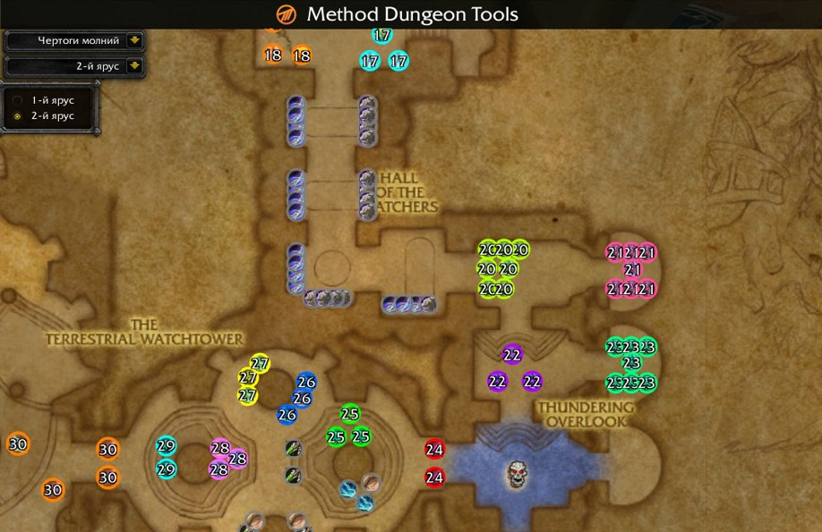
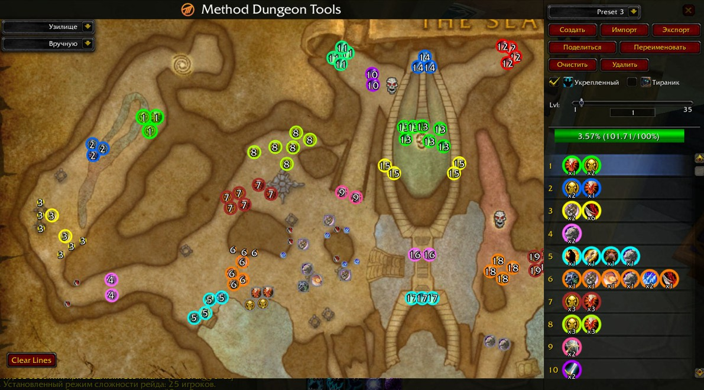
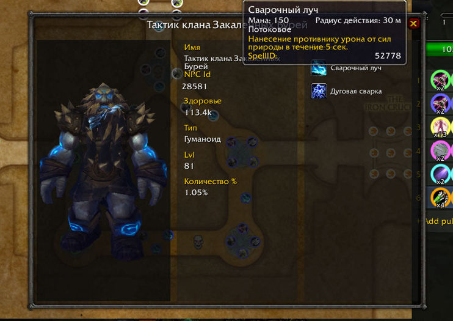

# ⚔️ Mythic/Method Dungeon Tools (MDT)
## Специальная адаптация для Sirus.su

Легендарный аддон с актуальных версий WoW для планирования маршрутов теперь доступен на Sirus! Это незаменимый инструмент для танков и групп, которые хотят проходить подземелья максимально эффективно, планировать каждый запул и оптимизировать время прохождения.

**[💾 СКАЧАТЬ АДДОН (GitHub)](https://github.com/Rodgare/MethodDungeonTools/releases/download/latest/MDT.zip)**
> *[💾 Альтернативная ссылка (GitLab)](https://gitlab.com/axel19911/MethodDungeonTools/-/jobs/artifacts/main/raw/MDT.zip?job=build_addon) — используйте, если GitHub недоступен.*  

**⚙️ Установка**  
  
Если скачали по прямой ссылке выше:
  Просто переместите папку MethodDungeonTools в вашу папку с аддонами. Ничего переименовывать не нужно.

Если скачали через Code -> Download Zip:
  После скачивания не забудьте удалить -main из названия папки, чтобы в результате название папки получилось MethodDungeonTools без -main.  
  Правильное название MethodDungeonTools  
  Неправильное название MethodDungeonTools-main

### 🚀 Основные возможности

* **🗺️ Интерактивная карта подземелий**
  Полная визуализация всех этажей и комнат. Планируйте перемещение группы прямо в интерфейсе аддона.

* **📊 Точный расчет прогресса**
  Забудьте о лишнем трэше или нехватке процентов. Аддон отображает ценность каждого моба в % и автоматически суммирует прогресс выбранных паков.

* **🔍 Аналитика NPC**
  Вся база знаний под рукой. По правому клику на моба открывается подробное досье:
  * **Способности и заклинания:** Список всех кастов и аурок с их описанием.
  * **Характеристики:** Тип существа (гуманоид, нежить и т.д.) и актуальное количество здоровья (HP).

### 🔥 Специфика Sirus и Новые Фишки

* **❄️ Эксклюзивный контент Sirus.su**
  В базу уже занесены и детально наполнены 8 актуальных подземелий:
  * Все координаты мобов и их характеристики синхронизированы с текущими патчами сервера.

* **📋 Система Экспорта и Импорта**
  Поделитесь маршрутом с друзьями в один клик! Аддон позволяет копировать текстовую строку маршрута и мгновенно загружать чужие тактики.

* **🎨 Планирование пулла (Pulls)**
  Объединяйте мобов в группы, чтобы видеть порядок запулов и итоговый процент. **Ctrl + Клик** позволяет рисовать на карте.

---

**❤️ Благодарности**  
  * **Спасибо [Aimonfae](https://sirus.su/base/character/x3/Aimonfae) [Сила соли](https://sirus.su/base/guilds/x3/1704)**
  * **Спасибо [Димапотняк](https://sirus.su/base/character/x3/%D0%94%D0%B8%D0%BC%D0%B0%D0%BF%D0%BE%D1%82%D0%BD%D1%8F%D0%BA) [Ленивые коты](https://sirus.su/base/guilds/x3/913)**
  * **Спасибо [Иллюхер](https://sirus.su/base/character/x3/%D0%98%D0%BB%D1%8E%D1%85%D0%B5%D1%80) [Лилу Даллас](https://sirus.su/base/guilds/x3/3209)**
  * **Спасибо [Дворфу](https://discordapp.com/users/285113754021134337)**
  * **Спасибо стримеру [SEGAZBS](https://www.twitch.tv/segazbs) за помощь в разработке некоторых фич**
  * **Спасибо всем остальным кто отправляет баги и оставляет отзывы**

---

### 🐛 Обратная связь

Аддон активно развивается. Если вы нашли баг, неточность в координатах или % моба — пишите, буду стараться все исправить!

* **В игре:** ПМ `Coda x3`
* **Discord:** [Stratocaster](https://discordapp.com/users/123456789012345678)
* **Discord ключников:** [БОГИ ДИПЛИТА](https://discord.gg/5dtFjRr4W)
* [Гитхаб](https://github.com/Rodgare/MethodDungeonTools)
* [Гитлаб](https://gitlab.com/axel19911/MethodDungeonTools)

**🎨 Известные баги**  

3д модельки могут не подгружаться до входа в данж, пока непонятно как это фиксить, так работает на уровне клиента игры

